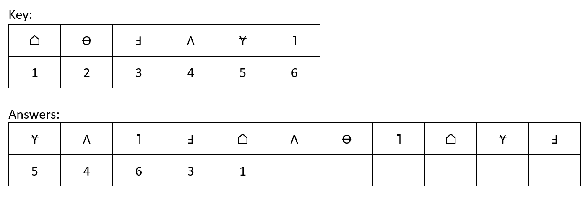

# Measuring Processing Speed App 

An app that can measure your Processing Speed (i.e., part of the Wechsler Adult Intelligence Scale IV). My app for the course "Programming the Next Step".

## Project Description

### **Processing Speed Test**

**Language**: R Shiny

Processing speed is a measure of the time required to respond to and/or process information in one's environment. The Processing Speed Index (PSI) is a part of the WAIS-IV (Wechsler Adult Intelligence Scale IV)

The Processing Speed Index (PSI) test contains 2 parts:

-   Symbol Search
    -   In this task, participants are required to observe rows of symbols and target symbols, and indicate the presence or absence of the target symbols in each row. They can indicate this by pushing a button on the keyboard (i.e., "1" for yes, and "0" for no).
    -   
-   Coding
    -   In this task, participants are tasked with transcribing a digit-symbol code utilizing a provided key. They type in the answer in a box underneath the question. The task imposes a time constraint (i.e., they can do as many as they can in 2 minutes).
    -   

**Learning goals**:

-   User interface development

-   Setting a time-constraint on one of the tasks

**Possible implementations**:

-   Calculating processing speed score of participant (possibly alos

-   Calculating sub-scores for the individual parts of the test
