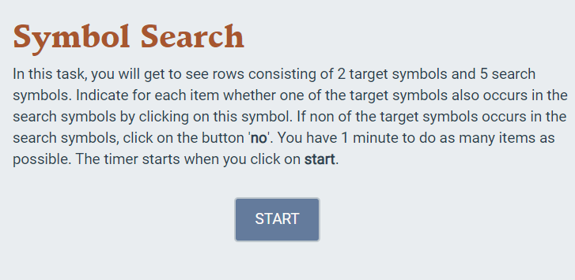
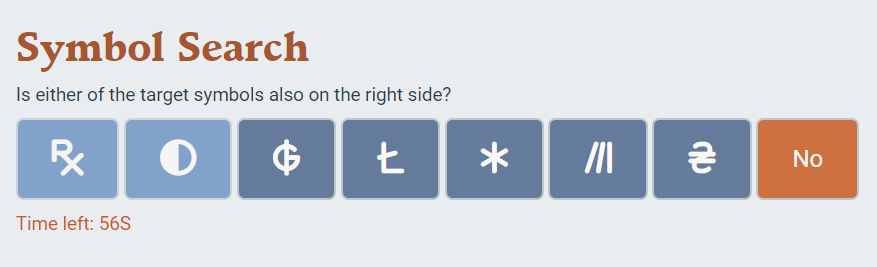
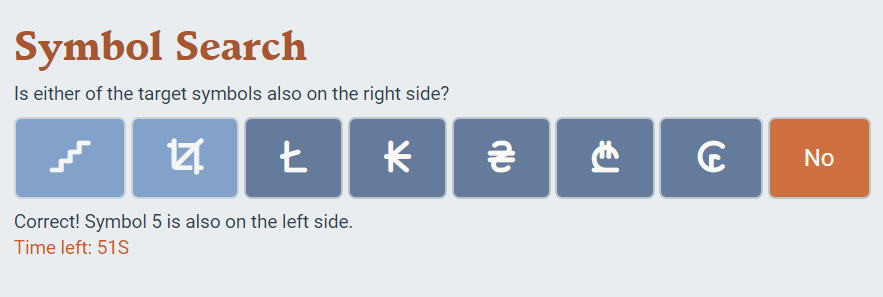
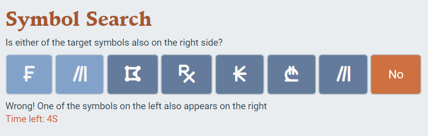

```{r, include = FALSE}
knitr::opts_chunk$set(
  collapse = TRUE,
  comment = "#>"
)
```

```{r setup, echo = FALSE}
library(ProcessingSpeed)
```

In this vignette, I discuss the functionality of *Symbol-Search* App and the package *ProcessingSpeed*, which contains a small symbol search game that can measure the users relative processing speed. 

## Generating Items for the Game 
If you run the symbols-app it automatically generates 30 items for the game, but you can increase this number by changing the only parameter nr_items of GenerateItems() to a different number. This function then creates a list of the specified number of items, with a string of answers and the relative positions of the answers in relation to the buttons on the screen. See below.

```{r}
my_items <- GenerateItems(nr_items = 5)
my_items
```
These items are then used in the Symbol-Search App 

## The Symbol Search App 
When you run the symbol search app, you open on the start screen, with the instructions of the task. 
```{r, fig.align = 'left', out.width = "80%", echo = FALSE}
 
```
When you click on start, the timer of one minute starts and you can make the given items as fast as possible. 
```{r, fig.align = 'left', out.width = "80%", echo = FALSE}
 
```
When you click on an item you are informed about whether or not the answer was correct. 
E.g., when you rightly click on the fifth button: 
```{r, fig.align = 'left', out.width = "80%", echo = FALSE}
 
```
or, after having wrongly clicked on "no"
```{r, fig.align = 'left', out.width = "80%", echo = FALSE}
 
```
